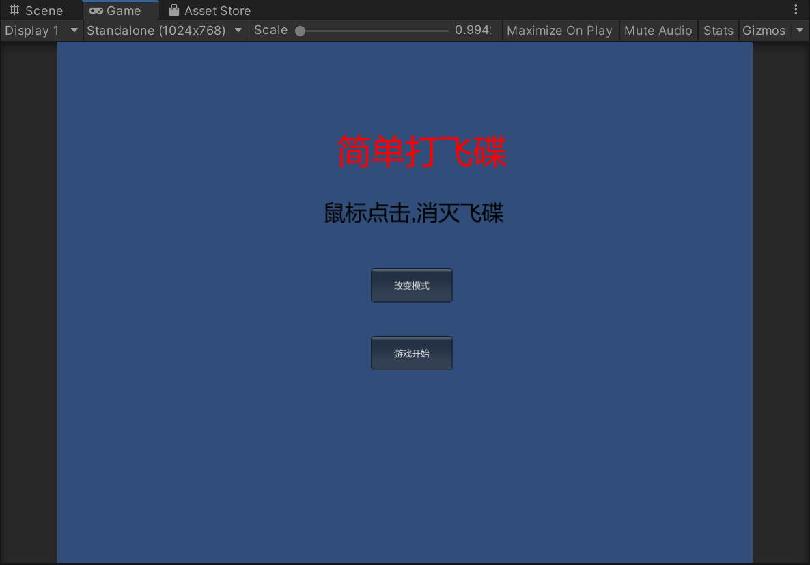
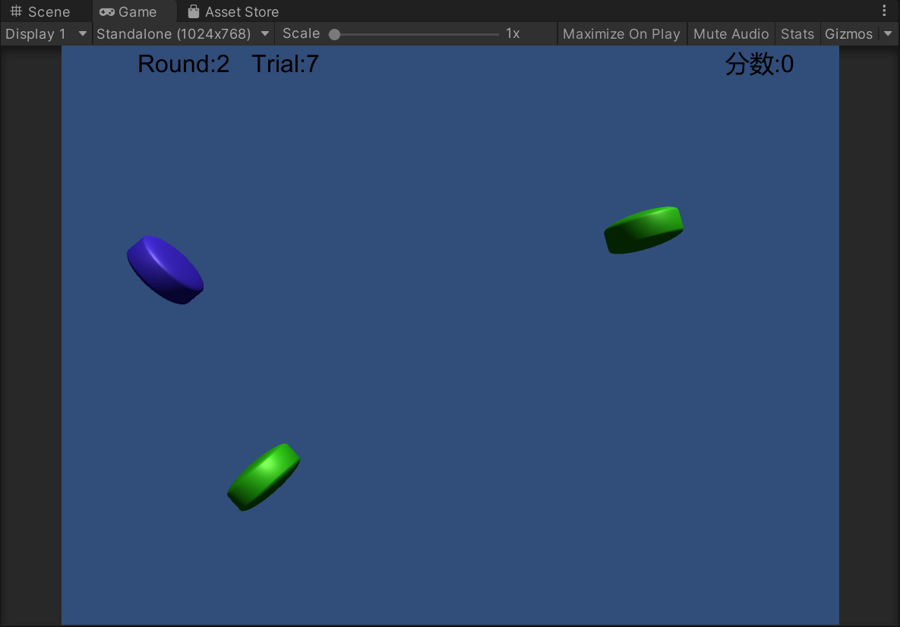
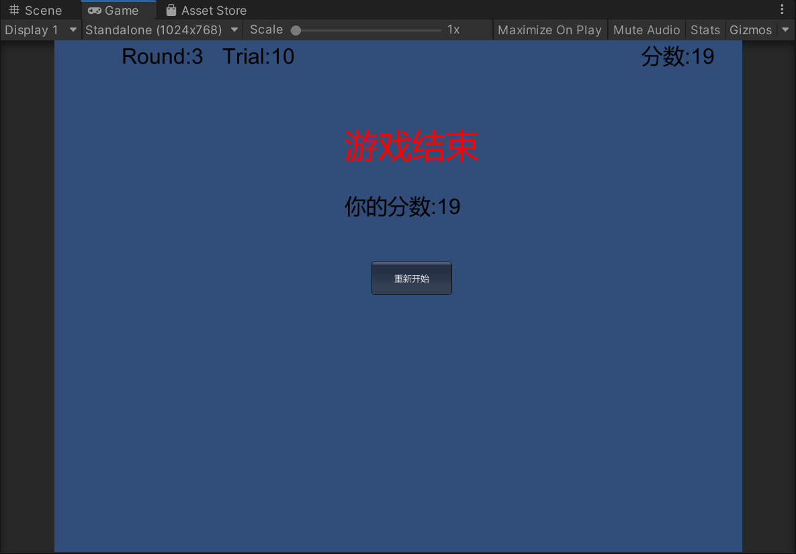
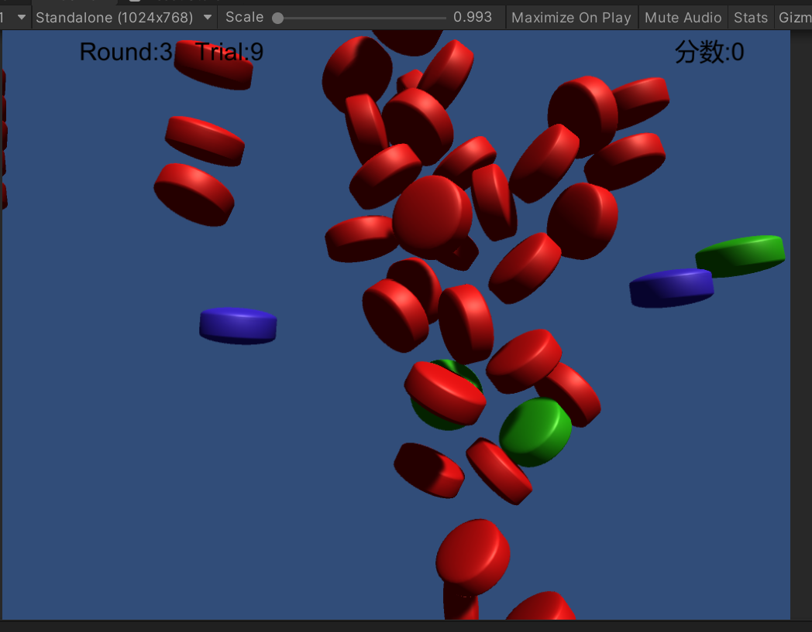
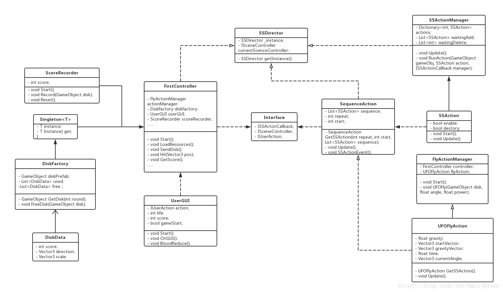

# HW4 Hit UFO 实验报告

## 1  游戏要求

1、编写一个简单的鼠标打飞碟（Hit UFO）游戏

- 游戏内容要求：
  1. 游戏有 n 个 round，每个 round 都包括10 次 trial；
  2. 每个 trial 的飞碟的色彩、大小、发射位置、速度、角度、同时出现的个数都可能不同。它们由该 round 的 ruler 控制；
  3. 每个 trial 的飞碟有随机性，总体难度随 round 上升；
  4. 鼠标点中得分，得分规则按色彩、大小、速度不同计算，规则可自由设定。
- 游戏的要求：
  - 使用带缓存的工厂模式管理不同飞碟的生产与回收，该工厂必须是场景单实例的！具体实现见参考资源 Singleton 模板类
  - 近可能使用前面 MVC 结构实现人机交互与游戏模型分离

* 添加：游戏内容要求：
  * 按 *adapter模式* 设计图修改飞碟游戏
  * 使它同时支持物理运动与运动学（变换）运动

## 2 项目资源

[演示视频](https://www.bilibili.com/video/BV1gR4y1n7jk/)

[代码地址](https://gitee.com/hurq5/GameDesign3D/tree/master/hw4(Hit_UFO))

## 3 游戏截图

**开始界面**



**游戏界面**



游戏结束界面



物理运动下，物体碰撞图（为了制造碰撞效果，加大发射飞碟数量，并非游戏中的效果）



## 4 项目配置

下载该项目，新建一个项目，使用里面的Assets覆盖新项目的Assets，选择Sences文件夹下的myScene场景，运行游戏。

## 5 架构设计

1. 参考动作分离版牧师与魔鬼实现动作的管理，保留SSDirector、SSAction与SSActionManager。

2. 所有的接口整理放入Interface中
3. 引入的就是Singleton，以及DiskData与DiskFactory。其中DiskFactory是单例的，用来管理飞碟出场的；DiskData是用来定义每一个飞碟的属性。
   UML图：



## 6 模块介绍

### 6.1 Singleton

场景单实例类，该类负责创建自己的对象，同时确保只有单个对象被创建。这个类提供了一种访问其唯一的对象的方式，可以直接访问，不需要实例化该类的对象。

使用泛型单例模板，方便单例变量直接利用该模板进行定义。

```
using System.Collections;
using System.Collections.Generic;
using UnityEngine;

public class Singleton<T> : MonoBehaviour where T : MonoBehaviour {
    protected static T instance;
    public static T Instance {
        get {
            if (instance == null) {
                instance = (T)FindObjectOfType(typeof(T));

                if (instance == null) {
                    Debug.LogError("An instance of " + typeof(T)
                        + " is needed in the scene, but there is none.");
                }
            }
            return instance;
        }
    }
}
```

### 6.2 SSDiretor

导演类，作用和牧师与魔鬼中的相同

```
public class SSDirector : System.Object {
    private static SSDirector _instance;
    public ISceneController CurrentScenceController { get; set; }
    public static SSDirector GetInstance() {
        if (_instance == null) {
            _instance = new SSDirector();
        }
        return _instance;
    }
}
```


### 6.3 Interface

将程序中的接口进行整理，其中还声明了ISSActionCallback接口，该接口的实现，就可以知道到“某个动作已完成”（动作一完成SSActionEvent方法就会被调用），并对这个事件做出反应。

```
using System.Collections;
using System.Collections.Generic;
using UnityEngine;
//场景控制类
public interface ISceneController {
    void LoadResources();                                  
}
//接口类
public interface IUserAction {
    void Hit(Vector3 pos);
    float GetScore();
    int GetRound();
    int GetTrial();
    void GameOver();
    void ReStart();
}
public enum SSActionEventType : int { Started, Competeted }
public interface ISSActionCallback {
    void SSActionEvent(SSAction source, SSActionEventType events = SSActionEventType.Competeted,
        int intParam = 0, string strParam = null, Object objectParam = null);
}
```

### 6.4 SceneController

#### 6.4.1 FirstController

1. 在Update中设置count_time起到计时的作用，设置游戏有 3 个 round，每个 round 都包括10 次 trial；在第一轮中每500次update发送一次飞碟（一次trial），10次trial后round切换到第二轮，在第二轮中每250次update发送一次飞碟（一次trial），同理切换到第三轮时，每125次update发送一次飞碟。这样就实现了发送飞碟的频率越来越高，使得游戏难度原来越高。每隔一定时间从飞碟工厂中获取一个飞碟并发射，检测用户点击发送的射线是否与飞碟发生碰撞，有则通知记分员加分并且通知工厂回收飞碟。

   ```
   	void Update () {
           if(running) {
               count_time++;
               if (Input.GetButtonDown("Fire1")) {
                   Vector3 pos = Input.mousePosition;
                   Hit(pos);
               }
               switch (round) {
                   case 1: {
                           if (count_time >= 500) {
                               count_time = 0;
                               SendDisk(1);
                               trial += 1;
                               if (trial == 10) {
                                   round += 1;
                                   trial = 0;
                               }
                           }
                           break;
                       }
                   case 2: {
                           if (count_time >= 250) {
                               count_time = 0;
                               if (trial % 2 == 0) SendDisk(1);
                               else SendDisk(2);
                               trial += 1;
                               if (trial == 10) {
                                   round += 1;
                                   trial = 0;
                               }
                           }
                           break;
                       }
                   case 3: {
                           if (count_time >= 125) {
                               count_time = 0;
                               if (trial % 3 == 0) SendDisk(1);
                               else if(trial % 3 == 1) SendDisk(2);
                               else SendDisk(3);
                               trial += 1;
                               if (trial == 10) {
                                   running = false;
                               }
                           }
                           break;
                       }
                   default:break;
               } 
               disk_factory.FreeDisk();
           }
       }
   ```

2. 实现接口Hit，Hit函数检测射线与飞碟是否碰撞，如碰撞则计分并回收飞碟。

   ```
       public void Hit(Vector3 pos) {
           Ray ray = Camera.main.ScreenPointToRay(pos);
           RaycastHit[] hits;
           hits = Physics.RaycastAll(ray);
           for (int i = 0; i < hits.Length; i++) {
               RaycastHit hit = hits[i];
               if (hit.collider.gameObject.GetComponent<Disk>() != null) {
                   score_recorder.Record(hit.collider.gameObject);
                   hit.collider.gameObject.transform.position = new Vector3(0, -10, 0);
               }
           }
       }
   ```

3. 实现接口SendDisk，SendDisk 从工厂中拿飞碟并根据种类设置发射参数，然后调用动作管理器执行动作。

   ```
   
       public GameObject GetDisk(int type) {
           GameObject disk_prefab = null;
           //寻找空闲飞碟，如有空闲则不需要多实例化一个
           if (free.Count>0) {
               for(int i = 0; i < free.Count; i++) {
                   if (free[i].type == type) {
                       disk_prefab = free[i].gameObject;
                       free.Remove(free[i]);
                       break;
                   }
               }     
           }
   
           if(disk_prefab == null) {
               if(type == 1) {
                   disk_prefab = Instantiate(
                   Resources.Load<GameObject>("Prefabs/disk1"),
                   new Vector3(0, -10f, 0), Quaternion.identity);
               }
               else if (type == 2) {
                   disk_prefab = Instantiate(
                   Resources.Load<GameObject>("Prefabs/disk2"),
                   new Vector3(0, -10f, 0), Quaternion.identity);
               }
               else {
                   disk_prefab = Instantiate(
                   Resources.Load<GameObject>("Prefabs/disk3"),
                   new Vector3(0, -10f, 0), Quaternion.identity);
               }
   
               disk_prefab.GetComponent<Renderer>().material.color = disk_prefab.GetComponent<Disk>().color;
           }
   
           used.Add(disk_prefab.GetComponent<Disk>());
           disk_prefab.SetActive(true);
           return disk_prefab;
       }
   ```

   

### 6.5 GameObjects

#### 6.5.1 Disk

定义飞碟数据

```
using System.Collections;
using System.Collections.Generic;
using UnityEngine;

public class Disk : MonoBehaviour {
    public int type = 1;
    public int score = 1;                               
    public Color color = Color.white;                    
}
```

#### 6.5.2 DiskFactory 

工厂一方面可以解耦：把对象的创建和使用的过程分开，另一方面能够让我们有效的利用已经构造好的游戏对象来实现资源的重利用，从而减少资源开销

根据老师给的伪代码实现

```
getDisk(ruler) 
BEGIN
	IF (free list has disk) THEN
	a_disk = remove one from list
	ELSE
	a_disk = clone from Prefabs
	ENDIF
	Set DiskData of a_disk with the ruler
	Add a_disk to used list
	Return a_disk
END
FreeDisk(disk)
BEGIN
	Find disk in used list
	IF (not found) THEN THROW exception
	Move disk from used to free list
END

```

维护两个列表，一个是正在使用的飞碟集合used，一个是空闲的飞碟集合free。当场景控制器需要获取一个飞碟时，先在空闲列表中寻找可用的空闲飞碟，如果找不到就根据预制重新实例化一个飞碟。回收飞碟的逻辑为遍历使用列表，当有飞碟已经完成了所有动作，即位置在摄像机之下，则回收。

```
using System.Collections;
using System.Collections.Generic;
using UnityEngine;

public class DiskFactory : MonoBehaviour {
    private List<Disk> used = new List<Disk>();
    private List<Disk> free = new List<Disk>();

    public GameObject GetDisk(int type) {
        GameObject disk_prefab = null;
        //寻找空闲飞碟，如有空闲则不需要多实例化一个
        if (free.Count>0) {
            for(int i = 0; i < free.Count; i++) {
                if (free[i].type == type) {
                    disk_prefab = free[i].gameObject;
                    free.Remove(free[i]);
                    break;
                }
            }     
        }

        if(disk_prefab == null) {
            if(type == 1) {
                disk_prefab = Instantiate(
                Resources.Load<GameObject>("Prefabs/disk1"),
                new Vector3(0, -10f, 0), Quaternion.identity);
            }
            else if (type == 2) {
                disk_prefab = Instantiate(
                Resources.Load<GameObject>("Prefabs/disk2"),
                new Vector3(0, -10f, 0), Quaternion.identity);
            }
            else {
                disk_prefab = Instantiate(
                Resources.Load<GameObject>("Prefabs/disk3"),
                new Vector3(0, -10f, 0), Quaternion.identity);
            }

            disk_prefab.GetComponent<Renderer>().material.color = disk_prefab.GetComponent<Disk>().color;
        }

        used.Add(disk_prefab.GetComponent<Disk>());
        disk_prefab.SetActive(true);
        return disk_prefab;
    }

    public void FreeDisk() {
        for(int i=0; i<used.Count; i++) {
            if (used[i].gameObject.transform.position.y <= -10f) {
                free.Add(used[i]);
                used.Remove(used[i]);
            }
        }          
    }

    public void Reset() {
        FreeDisk();
    }
}

```

#### 6.4.3 ScoreRecorder

记分器类，初始状态分数变量score为0，此后每次击中飞碟则累加上此飞碟对应的分数，重新开始游戏则重置score为0。

```
using System.Collections;
using System.Collections.Generic;
using UnityEngine;

/*记录分数*/
public class ScoreRecorder : MonoBehaviour {
    private float score;
    void Start () {
        score = 0;
    }
    public void Record(GameObject disk) {
        score += disk.GetComponent<Disk>().score;
    }
    public float GetScore() {
        return score;
    }
    public void Reset() {
        score = 0;
    }
}

```

### 6.5  ActionController

#### 6.5.1 DiskFlyAction

通过位置变换和角度变换模拟飞碟的飞行。当飞碟的高度在摄像机观察范围之下时则动作停止。DiskFlyAction不能直接通过new来得到对象，只能通过它的静态方法GetSSAction()来新建实例。

当DiskFlyAction发现自己的动作完成的时候，它会将自己标识为“要被销毁”并告诉动作管理或动作组合这个动作已完成。

```
using System.Collections;
using System.Collections.Generic;
using UnityEngine;

public class DiskFlyAction : SSAction {
    public float gravity = -5;                                 //向下加速度
    private Vector3 start_vector;                              //初速度
    private Vector3 gravity_vector = Vector3.zero;             //加速度
    private Vector3 current_angle = Vector3.zero;              //欧拉角
    private float time;                                        //时间

    private DiskFlyAction() { }
    public static DiskFlyAction GetSSAction(int lor, float angle, float power) {
        //初始化物体
        DiskFlyAction action = CreateInstance<DiskFlyAction>();
        if (lor == -1) {
            action.start_vector = Quaternion.Euler(new Vector3(0, 0, -angle)) * Vector3.left * power * 0.1f;
        }
        else {
            action.start_vector = Quaternion.Euler(new Vector3(0, 0, angle)) * Vector3.right * power * 0.1f;
        }
        return action;
    }

    public override void Update() {
        //计算物体的向下的速度
        time += Time.fixedDeltaTime;
        gravity_vector.y = gravity * time/1.5f* 0.02f;

        //位移模拟
        transform.position += (start_vector + gravity_vector) * Time.fixedDeltaTime;
        current_angle.z = Mathf.Atan((start_vector.y + gravity_vector.y) / start_vector.x) * Mathf.Rad2Deg;
        transform.eulerAngles = current_angle;

        //如果物体y坐标小于-10，动作就做完了
        if (this.transform.position.y < -10) {
            this.destroy = true;
            this.callback.SSActionEvent(this);      
        }
    }

    public override void Start() { }
}

```

#### 6.5.2 FlyActionManager 

飞碟的动作管理类，当场景控制器需要发射飞碟时就调用DiskFly使飞碟飞行

```
using System.Collections;
using System.Collections.Generic;
using UnityEngine;

public class FlyActionManager : SSActionManager {
    public DiskFlyAction fly;  
    public PhysisDiskFlyAction pfly;
    public FirstController scene_controller;           

    protected void Start() {
        scene_controller = (FirstController)SSDirector.GetInstance().CurrentScenceController;
        scene_controller.action_manager = this;     
    }

    //飞碟飞行
    public void DiskFly(GameObject disk, float angle, float power) {
        disk.GetComponent<Rigidbody>().isKinematic = true;
        int lor = 1;
        if (disk.transform.position.x > 0) lor = -1;
        fly = DiskFlyAction.GetSSAction(lor, angle, power);
        this.RunAction(disk, fly, this);
    }

    public void physicsDiskFly(GameObject disk,float power){
        disk.GetComponent<Rigidbody>().isKinematic = false;
        int lor=1;
        if(disk.transform.position.x > 0) lor=-1;
        pfly=PhysisDiskFlyAction.GetSSAction(lor,power);
        this.RunAction(disk,pfly,this);
    }
}

```

#### 6.5.3 PhysisDiskFlyAction 

和DiskFlyAction相同，将所有操作都放进FixedUpdate()，当飞碟落到屏幕外时将飞碟的速度清空。Start()中对飞碟施加一个冲击力。

```
using System.Collections;
using System.Collections.Generic;
using UnityEngine;

public class PhysisDiskFlyAction : SSAction
{
    private Vector3 start_vector;                              
    public float power;
    private PhysisDiskFlyAction() { }
    public static PhysisDiskFlyAction GetSSAction(int lor, float power) {
        PhysisDiskFlyAction action = CreateInstance<PhysisDiskFlyAction>();
        if (lor == -1) {
            action.start_vector = Vector3.left * power * 0.8f;
        }
        else {
            action.start_vector = Vector3.right * power * 0.8f;
        }
        action.power = power;
        return action;
    }

    public override void Update() { }

    public override void FixedUpdate() {
        if (transform.position.y <= -10f) {
            gameobject.GetComponent<Rigidbody>().velocity = new Vector3(0, 0, 0);
            this.destroy = true;
            this.callback.SSActionEvent(this);
        }
    }

    public override void Start() {
        gameobject.GetComponent<Rigidbody>().AddForce(start_vector*3, ForceMode.Impulse);
    }
}

```

#### 6.5.4 SequenceAction

SequenceAction是SSAction的另一个子类，它代表一连串动作，也就是折线移动。按照sequence的动作顺序，一个一个地执行下来，如果repeat大于0则从头再执行一次。

SSActionEvent中source.destroy = false是因为SSMoveToAction到达指定地点以后会自动将自己标识为destroy，这一句话阻止它被销毁，因为如果有repeat，后面还要执行它。

SequenceAction是知道某一个子动作已执行完是因为它实现了ActionCallback，并将子动作的callback指向自己，当子动作完成的时候就会调用自己的SSActionEvent，它就会进入下一个动作。

```
using System.Collections;
using System.Collections.Generic;
using UnityEngine;

public class SequenceAction : SSAction, ISSActionCallback
{
    
    public List<SSAction> sequence;    //动作列表
    public int repeat = -1;  
    public int start = 0;              //动作索引

    public static SequenceAction GetSSAcition(int repeat, int start, List<SSAction> sequence)
    {
        SequenceAction action = ScriptableObject.CreateInstance<SequenceAction>();
        action.repeat = repeat;
        action.sequence = sequence;
        action.start = start;
        return action;
    }

    public override void Update()
    {
        if (sequence.Count == 0) return;
        if (start < sequence.Count)
        {
            sequence[start].Update();    
        }
    }

    public void SSActionEvent(SSAction source, SSActionEventType events = SSActionEventType.Competeted,
        int intParam = 0, string strParam = null, Object objectParam = null)
    {
        source.destroy = false;   
        this.start++;
        if (this.start >= sequence.Count)
        {
            this.start = 0;
            if (repeat > 0) repeat--;
            if (repeat == 0)
            {
                this.destroy = true;
                this.callback.SSActionEvent(this); 
            }
        }
    }

    public override void Start()
    {
        foreach (SSAction action in sequence)
        {
            action.gameobject = this.gameobject;
            action.transform = this.transform;
            action.callback = this;            
            action.Start();
        }
    }

    void OnDestroy(){
        
    }
}

```

### 6.6 UserGUI

游戏为开始前，即game_start==false时，显示菜单界面，包括标题，游戏规则，开始按钮，还有改变模式的按钮，直接点击开始按钮，游戏以运动学模式展开，点击改变模式后再开始游戏，则游戏为物理运动模式。

```
        else {
            GUI.Label(new Rect(Screen.width / 2 - 100, Screen.height / 2-250, 100, 100), "简单打飞碟", over_style);
            GUI.Label(new Rect(Screen.width / 2 - 120,  Screen.height / 2-150, 100, 100), "鼠标点击,消灭飞碟", text_style);
            if (GUI.Button(new Rect(Screen.width / 2 - 50,  Screen.height / 2 + 50, 120, 50), "游戏开始")) {
                game_start = true;
                action.ReStart();
            }
            if(GUI.Button(new Rect(Screen.width / 2 - 50, Screen.height / 2 - 50, 120, 50), "改变模式")){
                mode=mode^1;
            }
        }
```

游戏开始后，游戏界面显示当前的轮数，以及对应该轮的第几Trial，以及总分的显示，3轮游戏后，游戏介素，输出总分，以及显示重新开始的按钮。

```
        if (game_start) {
            GUI.Label(new Rect(Screen.width - 150, 10, 200, 50), "分数:"+ action.GetScore().ToString(), text_style);
            GUI.Label(new Rect(100, 10, 50, 50), "Round:" + action.GetRound().ToString(), text_style);
            GUI.Label(new Rect(250, 10, 50, 50), "Trial:" + action.GetTrial().ToString(), text_style);

            if (action.GetRound() == 3 && action.GetTrial() == 10) {
                GUI.Label(new Rect(Screen.width / 2 - 80, Screen.height / 2 - 250, 100, 100), "游戏结束", over_style);
                GUI.Label(new Rect(Screen.width / 2 - 80, Screen.height / 2-150, 100, 100), "你的分数:" + action.GetScore().ToString(), text_style);
                if (GUI.Button(new Rect(Screen.width / 2 - 40, Screen.height / 2-50, 120, 50), "重新开始")) {
                    action.ReStart();
                    return;
                }
                action.GameOver();
            }
        }
```


## 7 参考博客

优秀博客:[Unity3d学习之路-简单打飞碟小游戏](https://blog.csdn.net/c486c/article/details/79952255)

参考实现动作管理器部分:[Unity3D学习（4）之动作管理器](https://blog.csdn.net/LoveLove_BiangBiang/article/details/101774373)

