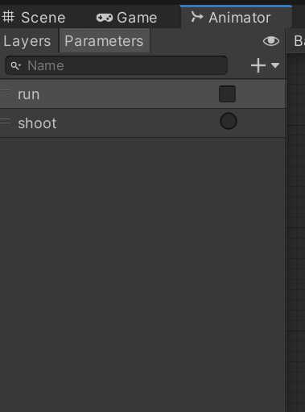

# HW6 智能巡逻兵 实验报告

## 1 游戏要求

### 1.1 游戏设计要求：

- 创建一个地图和若干巡逻兵(使用动画)；
- 每个巡逻兵走一个3~5个边的凸多边型，位置数据是相对地址。即每次确定下一个目标位置，用自己当前位置为原点计算；
- 巡逻兵碰撞到障碍物，则会自动选下一个点为目标；
- 巡逻兵在设定范围内感知到玩家，会自动追击玩家；
- 失去玩家目标后，继续巡逻；
- 计分：玩家每次甩掉一个巡逻兵计一分，与巡逻兵碰撞游戏结束；

### 1.2 程序设计要求：

- 必须使用订阅与发布模式传消息
  - subject：OnLostGoal
  - Publisher: ?
  - Subscriber: ?
- 工厂模式生产巡逻兵

### 1.3 友善提示1：生成 3~5个边的凸多边型

- 随机生成矩形
- 在矩形每个边上随机找点，可得到 3 - 4 的凸多边型
- 5 ?

### 1.4  友善提示2：参考以前博客，给出自己新玩法

## 2 项目资源

#### [代码资源](https://gitee.com/hurq5/GameDesign3D/tree/master/hw6(Patrol))

#### [演示视频](https://www.bilibili.com/video/BV1Fg411P7GB/)

## 3 游戏截图

游戏开始，显示10s游戏规则：（**游戏规则**为方向盘控制前进，左右旋转，前后移动，成功躲避巡逻兵追捕一次加1分，采集完所有的金矿即可获胜，滚轮可以实现镜头缩进和拉远,按着鼠标右键可以实现视角转动）


可以通过鼠标滚轮实现镜头缩进和拉远,按着鼠标右键实现视角转动，来观察游戏全貌


被巡逻兵抓住，游戏失败：


找到所有的金矿，游戏成功：


## 4 项目配置

下载代码资源（见上）地址中的`Assets`，新建unity3D项目，将下载的`Assets`文件夹替换掉新建项目的中的`Assets`文件夹，选择`Assets`中`Scenes`文件夹下的`myScenes`场景，点击运行按钮，即可开始游戏。

## 5 架构设计


## 6 创建预制

### 6.1 导入资源

创建一个地图和若干巡逻兵，可以先到[unity资源商店](https://assetstore.unity.com/?locale=zh-CN)中,在角色和环境大类中挑选出免费的且符合要求的资源，如下：


在unity中下载并导入到项目中。

### 6.2 创建预制

利用导入的资料包中的`Prefabs`文件夹下的预制，制作出我们所需要的人物和地图，拉到`Resources/Prefabs`下，并对其进行命以游戏中的名称，方便我们调用。

#### 6.2.1 地图

地图制作如下：


出来调整大小以及对地图内部加入木块进行隔离外，为了对实现对碰撞的监测，我们需要加入[Mesh Collider](https://docs.unity.cn/cn/2020.3/Manual/class-MeshCollider.html).


该场景中有9个格子，每个格子为一个区域，每个区域设置了一个`BoxCollider`用于检测玩家是否进入该区域。


#### 6.2.2 金矿


同理，为了对实现对碰撞的监测，我们需要加入[Mesh Collider](https://docs.unity.cn/cn/2020.3/Manual/class-MeshCollider.html).对`is Trigger`进行打勾，脚本要根据玩家碰撞到该金矿，进行相应的动作。


#### 6.2.3 巡逻兵和玩家

巡逻兵如下：


玩家如下：


其中为了使得人物具有具有使用物理引擎和碰撞检测的能力，我们需要为巡逻兵和玩家预制添加`Rigidbody`和`Capsule Collider`两个部件；

`Rigidbody`需要对`Freeze Rotation`各个方向进行打勾，这样但人物发生碰撞时，就不会因为有转动力而一直保持选择了；

`Capsule Collider`需要调整组件中的`Radius`和`Height`两个属性使得人物外围的球形边框与之大致重合，因为这代表人物的碰撞检测范围。


对于巡逻兵我们还需要点击`Hips`，添加`Box Collider`组件，改变`Size`来改变框的大小，并在`is Trigger`的方框后面打勾，这是用来作为巡逻兵的检测范围，一旦玩家进入该范围，巡逻兵就追逐他。


### 6.3 动画器预制

在Assets文件夹中新建一个`AnimatorController`文件夹，创建`PatrolController`和`PlayerController`两个`Animator Controller`。
动画器从导入的资源包中的Animations文件夹下查找

#### 6.3.1 PatrolController

按照游戏设计，对于巡逻兵，我们需要他在游戏未开始时候静止，在游戏开始时候巡逻，在玩家进入巡逻范围时，追逐玩家，在追到玩家的时候，对玩家进行攻击，因此我们只需要`idle`，`run`和`attack`三个动画，做出来的`PatrolController`如下：


对于巡逻兵各个动作之间的切换，通过变量来触发，设计布尔变量`run`，以及`Trigger`类型变量`shoot`



当`run`为`flase`的时候，巡逻兵静止（动作为`idle`），当`run`为`true`时候，巡逻兵奔跑（动作为`run`），当`shoot`变量呗触发的时候，巡逻兵发动攻击（动作为`attack`)。

设置方法如下，以巡逻兵从静止（`idle`）到奔跑（`run`）的触发设置为例，点击动作器图中`idle`指向`run`的白色箭头，出现以下画面，添加指定的`conditions`，调整`settings`中的时间条，调整为自己想要的转换动画效果。其他的动作转变设置同理。


#### 6.3.2 PlayerController

按照游戏设计，对于玩家，我们需要他在游戏未开始时候静止，在游戏开始时候run，在被巡逻兵追到的时候，倒地（die），因此我们只需要idle，run和die三个动画，做出来的`PatrolController`如下：


对于巡逻兵各个动作之间的切换，通过变量来触发，设计布尔变量run，以及Trigger类型变量death


当run为flase的时候，玩家静止（动作为idle），当run为true时候，玩家兵奔跑（动作为run），当death变量被触发的时候，玩家倒地（动作为die)。

动作转变的设置方法和上面是相同的，这里就不重复介绍了。

### 6.4 挂载脚本

为了在玩家，巡逻兵，金矿，每个区域检测到碰撞，程序作出相应的反应，我们需要分别在上面挂载脚本`PlayerCollide`，PatrolCollide，`GoldmineCollide`，`AreaCollide `

其次为了记录巡逻兵地属性，我们需要分别巡逻兵在上面挂载脚本`PatrolData`

这些脚本将在下面的模块介绍中展开说明。

## 7 模块介绍

### 7.1 碰撞脚本

#### 7.1.1 PlayerCollide

当玩家与侦察兵相撞，触发玩家的death变量，使玩家倒地，触发巡逻兵的shoot变量，使巡逻兵发动攻击，调用`PlayerGameover`表示游戏结束。

```c++
using System.Collections;
using System.Collections.Generic;
using UnityEngine;

public class PlayerCollide : MonoBehaviour
{

    void OnCollisionEnter(Collision other)
    {
        //当玩家与侦察兵相撞
        if (other.gameObject.tag == "Player")
        {
            //触发玩家的death变量，使玩家倒地
            other.gameObject.GetComponent<Animator>().SetTrigger("death");
            //触发巡逻兵的shoot变量,使巡逻兵发动攻击
            this.GetComponent<Animator>().SetTrigger("shoot");
            //游戏结束
            Singleton<GameEventManager>.Instance.PlayerGameover();
        }
    }
}

```

#### 7.1.2 PatrolCollide

* 当玩家进入侦察兵追捕范围，启动追捕模式，并将追捕对象设置为玩家，开始追捕
* 玩家跑出侦察兵追捕范围，关闭追捕模式，将追捕对象设置为空，结束追捕

```c++
using System.Collections;
using System.Collections.Generic;
using UnityEngine;

public class PatrolCollide : MonoBehaviour
{
    void OnTriggerEnter(Collider collider)
    {
    	//玩家进入侦察兵追捕范围，开始追捕
        if (collider.gameObject.tag == "Player")
        {
            //启动追捕模式
            this.gameObject.transform.parent.GetComponent<PatrolData>().follow_player = true;
            //将追捕对象设置为玩家
            this.gameObject.transform.parent.GetComponent<PatrolData>().player = collider.gameObject;
        }
    }
    void OnTriggerExit(Collider collider)
    {
        //玩家跑出侦察兵追捕范围，结束追捕
        if (collider.gameObject.tag == "Player")
        {
            //关闭追捕模式
            this.gameObject.transform.parent.GetComponent<PatrolData>().follow_player = false;
            //将追捕对象设置为空
            this.gameObject.transform.parent.GetComponent<PatrolData>().player = null;
        }
    }
}

```

#### 7.1.3 GoldmineCollide

当玩家与金矿相撞，设置金矿消失并减少金矿数量

```c++
using System.Collections;
using System.Collections.Generic;
using UnityEngine;

public class GoldmineCollide : MonoBehaviour
{
	//当玩家与金矿相撞
    void OnTriggerEnter(Collider collider)
    {
        if (collider.gameObject.tag == "Player" && this.gameObject.activeSelf)
        {
            //设置金矿消失
            this.gameObject.SetActive(false);
            //减少金矿数量
            Singleton<GameEventManager>.Instance.ReduceGoldmineNum();
        }
    }
}

```

#### 7.1.4 AreaCollide 

当玩家进入该区域的时候，通过调用`sceneController.wall_sign = sign;`设置场景控制器的区域标识为自己的标识，这样巡逻兵就知道玩家现在在哪个区域了

```c++
public class AreaCollide : MonoBehaviour
{
    public int sign = 0;
    FirstSceneController sceneController;
    private void Start()
    {
        sceneController = SSDirector.GetInstance().CurrentScenceController as FirstSceneController;
    }
    void OnTriggerEnter(Collider collider)
    {
        //标记玩家进入自己的区域
        if (collider.gameObject.tag == "Player")
        {
            sceneController.wall_sign = sign;
        }
    }
}
```

### 7.2 工厂模块

#### 7.2.1 PropFactory

* 在每个格子内分别创建了1个巡逻兵，还设置了每个巡逻兵所在区域的标志。

* 随机生成十二个金矿，每个格子可能有多个金矿，也可能只有一个

* 当游戏结束时候，需要工厂将巡逻兵的动画设置为初始状态。

```c++
using System.Collections;
using System.Collections.Generic;
using UnityEngine;

public class PropFactory : MonoBehaviour
{
    private GameObject patrol = null;                              //巡逻兵
    private List<GameObject> usedPatrol = new List<GameObject>();        //正在被使用的巡逻兵
    private GameObject goldmine = null;                             //金矿
    private List<GameObject> usedgoldmine = new List<GameObject>();      //正在被使用的金矿

	//在每个格子内分别创建了1个巡逻兵
    public List<GameObject> GetPatrols()
    {
        int[] pos_x = { -6, 4, 13 };
        int[] pos_z = { -4, 6, -13 };
        int index = 0;
        //生成不同的巡逻兵初始位置
        for (int i = 0; i < 3; i++)
        {
            for (int j = 0; j < 3; j++)
            {
                Vector3 vec = new Vector3(pos_x[i], 0, pos_z[j]);
                patrol = Instantiate(Resources.Load<GameObject>("Prefabs/Patrol"));
                patrol.transform.position = vec;
                patrol.GetComponent<PatrolData>().sign = index + 1;
                patrol.GetComponent<PatrolData>().start_position = vec;
                usedPatrol.Add(patrol);
                index++;
            }
        }

        return usedPatrol;
    }

	//随机生成十二个金矿
    public List<GameObject> GetGoldmine()
    {
        float range = 12;                                      //金矿生成的坐标范围
        for (int i = 0; i < 12; i++)
        {
            goldmine = Instantiate(Resources.Load<GameObject>("Prefabs/Goldmine"));
            float ranx = Random.Range(-range, range);
            float ranz = Random.Range(-range, range);
            goldmine.transform.position = new Vector3(ranx, 0, ranz);
            usedgoldmine.Add(goldmine);
        }

        return usedgoldmine;
    }
    
    public void StopPatrol()
    {
        int size = usedPatrol.Count;
        //切换所有侦查兵的动画
        for (int i = 0; i < size; i++)
        {
            usedPatrol[i].gameObject.GetComponent<Animator>().SetBool("run", false);
        }
    }
}

```

#### 7.2.2 PatrolData

成员变量如下：

```c++
    public int sign;                      //标志巡逻兵在哪一块区域
    public bool follow_player = false;    //是否跟随玩家
    public int wall_sign = -1;            //当前玩家所在区域标志
    public GameObject player;             //玩家游戏对象
    public Vector3 start_position;        //当前巡逻兵初始位置     
```

### 7.3 订阅与发布模式

在订阅与发布模式中订阅者没必要知道和功能调用有关的类，只需要知道发布者即可；
而发布者调用对应的方法来进行实际操作，使用这种模式来降低代码的耦合度。

在该程序中，`GameEventManager`作为发布者，`FirstSceneController`作为订阅者。

#### 7.3.1 GameEvenManager

作为发布者`GameEventManager`主要负责三个动作，分数变化、游戏结束、水晶数目

```c++
public class GameEventManager : MonoBehaviour
{
    //分数变化
    public void PlayerEscape()
    {
        if (ScoreChange != null)
        {
            ScoreChange();
        }
    }
    //游戏结束
    public void PlayerGameover()
    {
        if (GameoverChange != null)
        {
            GameoverChange();
        }
    }
    //水晶数量
    public void ReduceCrystalNum()
    {
        if (CrystalChange != null)
        {
            CrystalChange();
        }
    }
}

```

#### 7.3.2 FirstSceneController

作为订阅者，订阅了`GameEventManager`中的事件，因此只要相应事件发生，就会导致场景控制器调用注册的方法。

```c++
void OnEnable()
{
    //注册事件
    GameEventManager.ScoreChange += AddScore;
    GameEventManager.GameoverChange += Gameover;
    GameEventManager.CrystalChange += ReduceCrystalNumber;
}
void OnDisable()
{
    //取消注册事件
    GameEventManager.ScoreChange -= AddScore;
    GameEventManager.GameoverChange -= Gameover;
    GameEventManager.CrystalChange -= ReduceCrystalNumber;
}
void ReduceCrystalNumber()
{
    recorder.ReduceCrystal();
}
void AddScore()
{
    recorder.AddScore();
}
void Gameover()
{
    game_over = true;
    patrol_factory.StopPatrol();
    action_manager.DestroyAllAction();
}
```

### 7.4 动作管理模块

#### 7.4.1 SSActionManager

动作管理器`SSActionManager`需要控制巡逻兵的动作，使用列表管理巡逻兵追踪或者巡逻，代码和注释如下：

```c++

public class SSActionManager : MonoBehaviour, ISSActionCallback
{
    private Dictionary<int, SSAction> actions = new Dictionary<int, SSAction>();    //将执行的动作的字典集合
    private List<SSAction> waitingAdd = new List<SSAction>();                       //等待去执行的动作列表
    private List<int> waitingDelete = new List<int>();                              //等待删除的动作的key                

    protected void Update()
    {
    	//对于等待执行的动作列表，将其添加到执行动作列表中，并将等待列表清空
        foreach (SSAction ac in waitingAdd)
        {
            actions[ac.GetInstanceID()] = ac;
        }
        waitingAdd.Clear();
		//对于执行动作列表中的每一个动作，如果动作需要销毁则加入待删除列表中，相反则进行该动作
        foreach (KeyValuePair<int, SSAction> kv in actions)
        {
            SSAction ac = kv.Value;
            if (ac.destroy)
            {
                waitingDelete.Add(ac.GetInstanceID());
            }
            else if (ac.enable)
            {
                //运动学运动更新
                ac.Update();
            }
        }
		//对于等待删除列表中的动作，将其在执行列表中删除，并销毁该动作对象。
        foreach (int key in waitingDelete)
        {
            SSAction ac = actions[key];
            actions.Remove(key);
            DestroyObject(ac);
        }
        waitingDelete.Clear();
    }
 
    public void RunAction(GameObject gameobject, SSAction action, ISSActionCallback manager)
    {
    	//建立动作并将动作添加到等待执行列表中
        action.gameobject = gameobject;
        action.transform = gameobject.transform;
        action.callback = manager;
        waitingAdd.Add(action);
        action.Start();
    }

    public void SSActionEvent(SSAction source, int intParam = 0, GameObject objectParam = null)
    {
        if(intParam == 0)
        {
            //巡逻兵跟随玩家
            PatrolFollowAction follow = PatrolFollowAction.GetSSAction(objectParam.gameObject.GetComponent<PatrolData>().player);
            this.RunAction(objectParam, follow, this);
        }
        else
        {
            //巡逻兵继续巡逻
            GoPatrolAction move = GoPatrolAction.GetSSAction(objectParam.gameObject.GetComponent<PatrolData>().start_position);
            this.RunAction(objectParam, move, this);
            //玩家离开
            Singleton<GameEventManager>.Instance.PlayerEscape();
        }
    }

	
    public void DestroyAll()
    {
        foreach (KeyValuePair<int, SSAction> kv in actions)
        {
            SSAction ac = kv.Value;
            ac.destroy = true;
        }
    }
}

```

#### 7.4.2 PatrolActionManager

场景控制器调用`PatrolActionManager`中的方法，让巡逻兵开始巡逻，当游戏结束的时候，调用方法让巡逻兵停止巡逻

```c++
public class PatrolActionManager : SSActionManager
{
    private GoPatrolAction go_patrol;                            //巡逻兵巡逻

    public void GoPatrol(GameObject patrol)
    {
        go_patrol = GoPatrolAction.GetSSAction(patrol.transform.position);
        this.RunAction(patrol, go_patrol, this);
    }
    //停止所有动作
    public void DestroyAllAction()
    {
        DestroyAll();
    }
}
```

#### 7.4.3 PatrolFollowAction

巡逻兵追逐玩家，当玩家离开了巡逻兵触发器的范围或是玩家已经不在该区域内了，巡逻兵停止追逐

```c++
public class PatrolFollowAction : SSAction
{
    private float speed = 2f;            //跟随玩家的速度
    private GameObject player;           //玩家
    private PatrolData data;             //侦查兵数据

    private PatrolFollowAction() { }
    public static PatrolFollowAction GetSSAction(GameObject player)
    {
        PatrolFollowAction action = CreateInstance<PatrolFollowAction>();
        action.player = player;
        return action;
    }

    public override void Update()
    {
        if (transform.localEulerAngles.x != 0 || transform.localEulerAngles.z != 0)
        {
            transform.localEulerAngles = new Vector3(0, transform.localEulerAngles.y, 0);
        }
        if (transform.position.y != 0)
        {
            transform.position = new Vector3(transform.position.x, 0, transform.position.z);
        }

        Follow();
        //如果侦察兵没有跟随对象，或者需要跟随的玩家不在侦查兵的区域内
        if (!data.follow_player || data.wall_sign != data.sign)
        {
            this.destroy = true;
            this.callback.SSActionEvent(this,1,this.gameobject);
        }
    }
    public override void Start()
    {
        data = this.gameobject.GetComponent<PatrolData>();
    }
    void Follow()
    {
        transform.position = Vector3.MoveTowards(this.transform.position, player.transform.position, speed * Time.deltaTime);
        this.transform.LookAt(player.transform.position);
    }
}
```

#### 7.4.4 GoPatrolAction

巡逻兵巡逻，根据四个方向来选择要去到的目的地，当当前位置与目的地相差0.9f的时候，换一个方向继续巡逻

```c++
using System.Collections;
using System.Collections.Generic;
using UnityEngine;

public class GoPatrolAction : SSAction
{
    private enum Dirction { EAST, NORTH, WEST, SOUTH };
    private float pos_x, pos_z;                  //移动前的初始x和z方向坐标
    private float move_length;                   //移动的长度
    private float move_speed = 1.2f;             //移动速度
    private bool Is_reach_des = true;            //是否到达目的地
    private Dirction dirction = Dirction.EAST;   //移动的方向
    private PatrolData patrol_data;              //侦察兵的数据


    private GoPatrolAction() { }
    public static GoPatrolAction GetSSAction(Vector3 location)
    {
        GoPatrolAction action = CreateInstance<GoPatrolAction>();
        action.pos_x = location.x;
        action.pos_z = location.z;
        //设定移动矩形的边长
        action.move_length = Random.Range(5, 8);
        return action;
    }
    void Gopatrol()
    {
        if (Is_reach_des)
        {
            switch (dirction)
            {
                case Dirction.EAST:
                    pos_x -= move_length;
                    break;
                case Dirction.NORTH:
                    pos_z += move_length;
                    break;
                case Dirction.WEST:
                    pos_x += move_length;
                    break;
                case Dirction.SOUTH:
                    pos_z -= move_length;
                    break;
            }
            Is_reach_des = false;
        }
        this.transform.LookAt(new Vector3(pos_x, 0, pos_z));
        float distance = Vector3.Distance(transform.position, new Vector3(pos_x, 0, pos_z));
        //当前位置与目的地距离浮点数的比较
        if (distance > 0.9)
        {
            transform.position = Vector3.MoveTowards(this.transform.position, new Vector3(pos_x, 0, pos_z), move_speed * Time.deltaTime);
        }
        else //转弯
        {
            dirction = dirction + 1;
            if (dirction > Dirction.SOUTH)
            {
                dirction = Dirction.EAST;
            }
            Is_reach_des = true;
        }
    }

    public override void Update()
    {
        //侦察移动
        Gopatrol();
        //如果侦察兵需要跟随玩家并且玩家就在侦察兵所在的区域，侦查动作结束
        if (patrol_data.follow_player && patrol_data.wall_sign == patrol_data.sign)
        {
            this.destroy = true;
            this.callback.SSActionEvent(this, 0, this.gameobject);
        }
    }
    public override void Start()
    {
        this.gameobject.GetComponent<Animator>().SetBool("run", true);
        patrol_data = this.gameobject.GetComponent<PatrolData>();
    }

}

```

### 7.5 主控制模块

包括IUserAction, SSDirector, ISceneController, FristController

在牧师与魔鬼和Hit UFO都使用过，不展开介绍逻辑，FristController的代码如下：

```c++
public class FirstSceneController : MonoBehaviour, IUserAction, ISceneController
{
    public PropFactory patrol_factory;                               //巡逻者工厂
    public ScoreRecorder recorder;                                   //记录员
    public PatrolActionManager action_manager;                       //运动管理器
    public int wall_sign = -1;                                       //当前玩家所处哪个格子
    public GameObject player;                                        //玩家
    public Camera main_camera;                                       //主相机
    public float player_speed = 5;                                   //玩家移动速度
    public float rotate_speed = 250f;                                //玩家旋转速度
    private List<GameObject> patrols;                                //场景中巡逻者列表
    private List<GameObject> goldmines;                               //场景金矿列表
    private bool game_over = false;                                  //游戏结束

    void Update()
    {
        for (int i = 0; i < patrols.Count; i++)
        {
            patrols[i].gameObject.GetComponent<PatrolData>().wall_sign = wall_sign;
        }
        //金矿收集完毕
        if(recorder.GetGoldmineNumber() == 0)
        {
            Gameover();
        }
    }
    void Start()
    {
        SSDirector director = SSDirector.GetInstance();
        director.CurrentScenceController = this;
        patrol_factory = Singleton<PropFactory>.Instance;
        action_manager = gameObject.AddComponent<PatrolActionManager>() as PatrolActionManager;
        LoadResources();
        main_camera.GetComponent<CameraFlow>().follow = player;
        recorder = Singleton<ScoreRecorder>.Instance;
    }

    public void LoadResources()
    {
        Instantiate(Resources.Load<GameObject>("Prefabs/Plane"));
        player = Instantiate(Resources.Load("Prefabs/Player"), new Vector3(0, 9, 0), Quaternion.identity) as GameObject;
        goldmines = patrol_factory.GetGoldmine();
        patrols = patrol_factory.GetPatrols();
        //所有侦察兵移动
        for (int i = 0; i < patrols.Count; i++)
        {
            action_manager.GoPatrol(patrols[i]);
        }
    }
    //玩家移动
    public void MovePlayer(float translationX, float translationZ)
    {
        if(!game_over)
        {
            if (translationX != 0 || translationZ != 0)
            {
                player.GetComponent<Animator>().SetBool("run", true);
            }
            else
            {
                player.GetComponent<Animator>().SetBool("run", false);
            }
            //移动和旋转
            player.transform.Translate(0, 0, translationZ * player_speed * Time.deltaTime);
            player.transform.Rotate(0, translationX * rotate_speed * Time.deltaTime, 0);
            //防止碰撞带来的移动
            if (player.transform.localEulerAngles.x != 0 || player.transform.localEulerAngles.z != 0)
            {
                player.transform.localEulerAngles = new Vector3(0, player.transform.localEulerAngles.y, 0);
            }
            if (player.transform.position.y != 0)
            {
                player.transform.position = new Vector3(player.transform.position.x, 0, player.transform.position.z);
            }     
        }
    }

    public int GetScore()
    {
        return recorder.GetScore();
    }

    public int GetGoldmineNumber()
    {
        return recorder.GetGoldmineNumber();
    }
    public bool GetGameover()
    {
        return game_over;
    }
    public void Restart()
    {
        SceneManager.LoadScene("Scenes/mySence");
    }

    void OnEnable()
    {
        GameEventManager.ScoreChange += AddScore;
        GameEventManager.GameoverChange += Gameover;
        GameEventManager.GoldmineChange += ReduceGoldmineNumber;
    }
    void OnDisable()
    {
        GameEventManager.ScoreChange -= AddScore;
        GameEventManager.GameoverChange -= Gameover;
        GameEventManager.GoldmineChange -= ReduceGoldmineNumber;
    }
    void ReduceGoldmineNumber()
    {
        recorder.ReduceGoldmine();
    }
    void AddScore()
    {
        recorder.AddScore();
    }
    void Gameover()
    {
        game_over = true;
        patrol_factory.StopPatrol();
        action_manager.DestroyAllAction();
    }
}

```

## 8 参考博客

[【Unity3D技巧】在Unity中使用事件/委托机制（event/delegate）进行GameObject之间的通信](https://www.cnblogs.com/neverdie/p/Unity3D_event_delegate_1.html)

[30分钟学会UML类图](https://zhuanlan.zhihu.com/p/109655171)

[Unity3d学习之路-简单巡逻兵](https://blog.csdn.net/c486c/article/details/80153548)

[解决 unity 2d 中人物碰撞后抖动旋转问题](https://blog.csdn.net/RookieWantToFly/article/details/107661664)

[【Unity3D】键盘鼠标控制视角的移动](https://blog.csdn.net/yongh701/article/details/71082441)

