# Unity3D 使用UGUI实现公告牌

## 1 实验要求

进入 [NGUI](http://www.tasharen.com/?page_id=140) 官方网站，使用 UGUI 实现以下效果[Quest Log](http://www.tasharen.com/ngui/example9.html) 公告牌

## 2 项目资源

[项目代码](https://gitee.com/hurq5/GameDesign3D/tree/master/hw7(BulletinBoard))

[演示视频](https://www.bilibili.com/video/BV133411v7dX/)

## 3 实现效果

展开前：

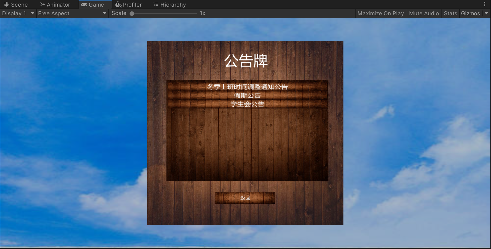

展开后：

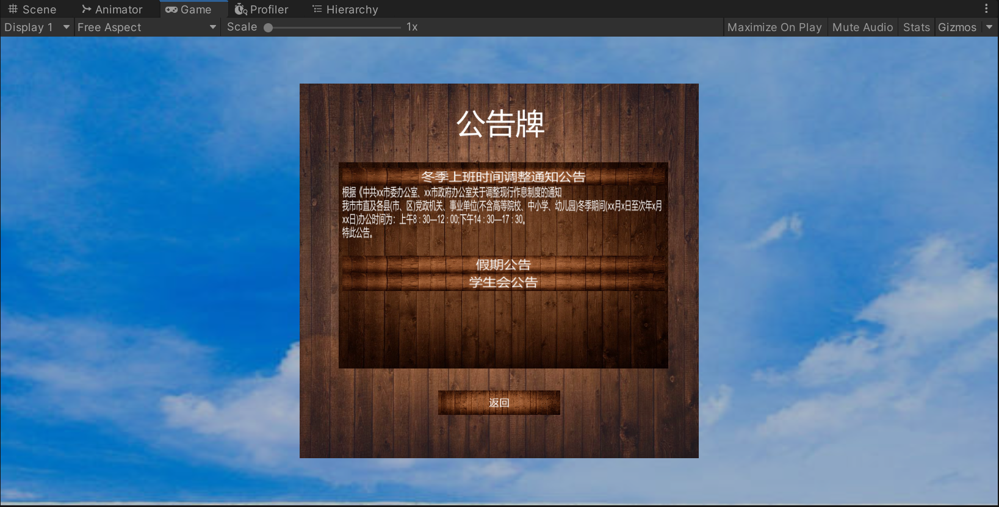

## 4 整体UI目录架构

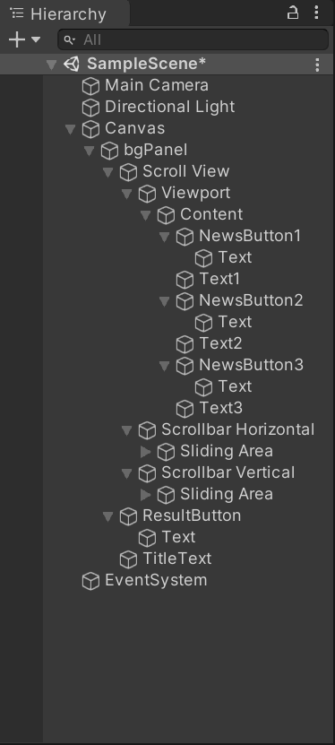

## 5 实现过程

**1 选择一个场景，在场景下创建一个panel，调整合适的尺寸，位置和颜色明暗，作为公告牌的背景板。**

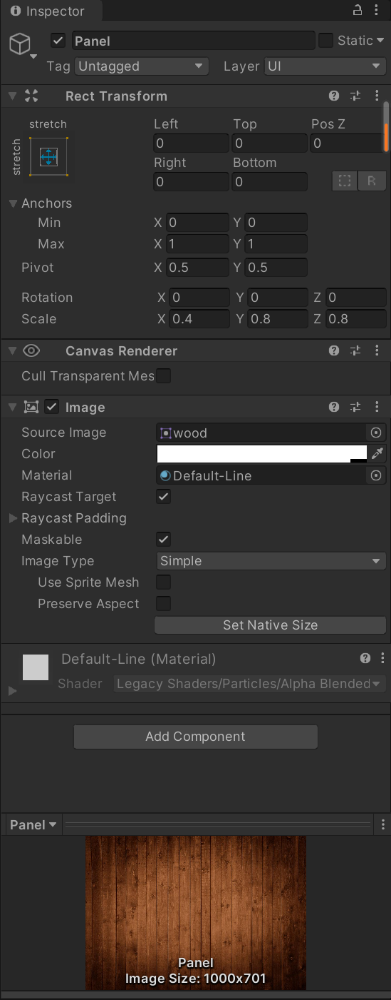

**2 创建一个ScollView,调整合适的尺寸，位置和颜色明暗，使其内嵌在panel中**

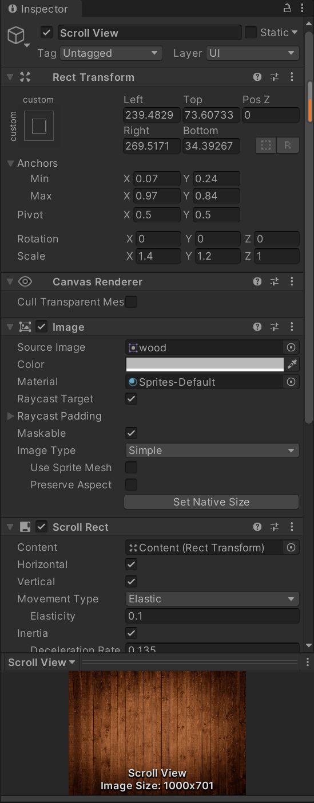

**3 在ScollView目录下Viewport下的Content中添加一个VerticalLayoutGroup组件**

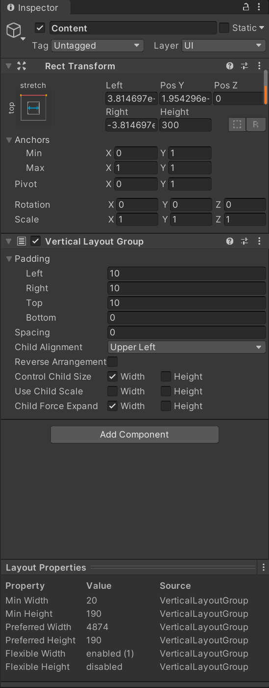

**4 并在Content中创建三个Button，分别命名为NewsButton1，NewsButton2，NewsButton3，和三个Text，分别命名为Text1，Text2，Text3，把每个Button的Transition设为None，并设置好他们的内容和位置，注意每个组件在目录中放置的位置。**

**5 需要给按钮添加以下脚本，通过每帧来改变文本的角度和文本的高度，来实现折叠和展开的效果，脚本代码如下**:

```c
using System.Collections;
using System.Collections.Generic;
using UnityEngine;
using UnityEngine.UI;
 
public class ButtonScript : MonoBehaviour {
 
    public Text text;
    private int frame = 20;
 
    void Start()
    {
        Button btn = this.gameObject.GetComponent<Button>();
        btn.onClick.AddListener(TaskOnClick);
        text.gameObject.SetActive(false);
    }
 
    IEnumerator Fold()
    {
        float rx = 0;
        float xy = 120;
        for (int i = 0; i < frame; i++)
        {
            rx -= 90f / frame;
            xy -= 120f / frame;
            text.transform.rotation = Quaternion.Euler(rx, 0, 0);
            text.rectTransform.sizeDelta = new Vector2(text.rectTransform.sizeDelta.x, xy);
            if (i == frame - 1)
            {
                text.gameObject.SetActive(false);
            }
            yield return null;
        }
    }
 
    IEnumerator Unfold()
    {
        float rx = -90;
        float xy = 0;
        for (int i = 0; i < frame; i++)
        {
            rx += 90f / frame;
            xy += 120f / frame;
            text.transform.rotation = Quaternion.Euler(rx, 0, 0);
            text.rectTransform.sizeDelta = new Vector2(text.rectTransform.sizeDelta.x, xy);
            if (i == 0)
            {
                text.gameObject.SetActive(true);
            }
            yield return null;
        }
    }
 
 
    void TaskOnClick()
    {
        if (text.gameObject.activeSelf)
        {
            StartCoroutine(Fold());
        }
        else
        {
            StartCoroutine(Unfold());
        }
        
    }
}
```

**并设置好每个按钮对应要展开的文本(以下是NewsBuuton1对应的文本是Text1)**

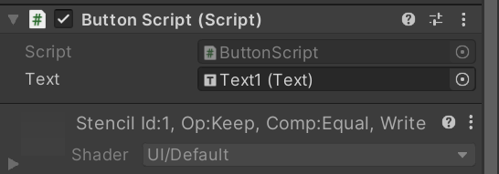

**6 对于背景图的设置，可以将背景图片拉到Image的组件中（没有该组件可以自己添加该组件）**

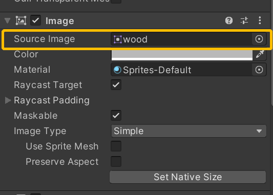

**注意图片的格式需要是Sprite，可以在属性栏里面自己对其进行更改。**

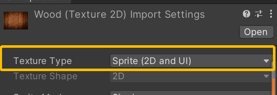

7  对于标题和放回按钮的设置，只需要在Canves下创建创建相应的Text和Button，并设置好位置，大小，内容等就可以了

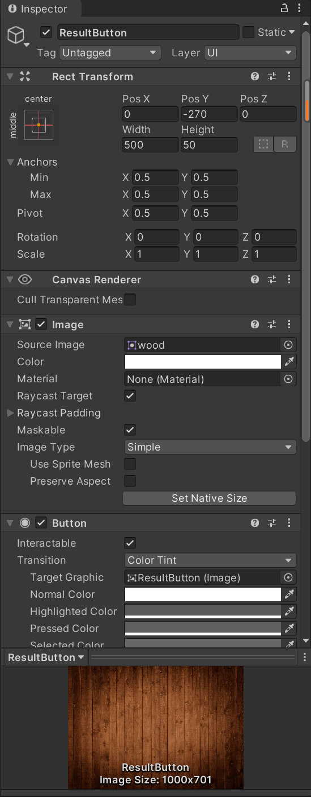

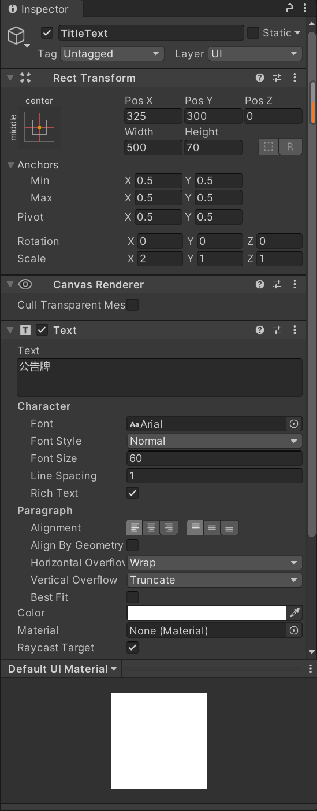